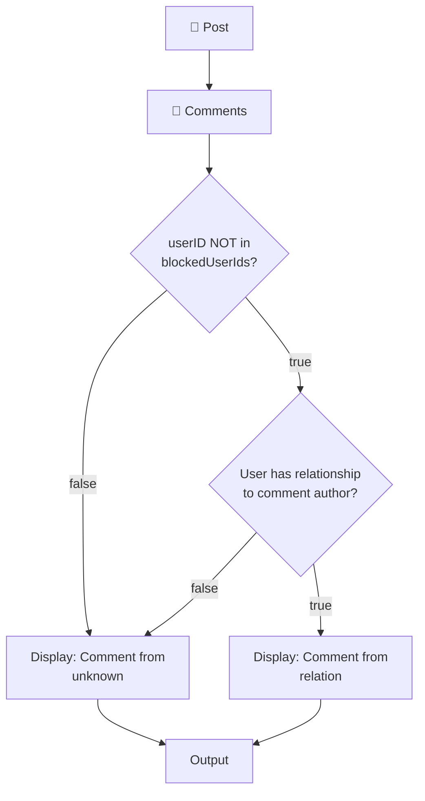

# Description
This is a 🅺otlin console application for public post and give comments 💬

# Made with

## Solution Design

### Overview
This application implements a **Hexagonal Architecture** pattern to manage Posts with Comments. The design ensures that each domain (Post and Comment) remains independent while allowing controlled interaction through clearly defined ports and adapters.

### Comment Processing Flow

The following diagram shows how comments are processed and displayed within a Post:

### Key Design Decisions

1. **Domain Independence**: Each domain (Post and Comment) maintains its own models and repositories without direct dependencies.

2. **Port-Based Integration**: 
   - The Post domain defines ports (interfaces) to interact with comments
   - The Comment domain provides implementations of these ports
   - Adapters in the application layer wire everything together

3. **Access Control**: 
   - The system checks if a user is blocked before displaying their comments
   - Relationship information is displayed based on user connections
   - Unknown users are properly labeled in the output

4. **Separation of Concerns**:
   - Domain logic remains pure and testable
   - Infrastructure details are isolated in adapters
   - The application layer orchestrates domain interactions